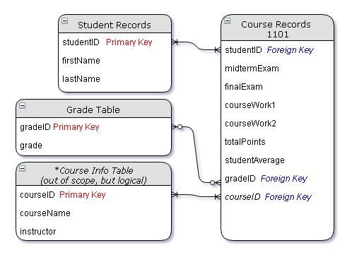
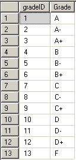

# Data Migration Project

### Course Review Project Documentation

1. [Intro](#intro)
      - [Course Review Project Requirements](#course-review-project-requirements)
      - [*Note](#-note)
2. [Methods](#methods)
      - [A section of the source data](#a-section-of-the-source-data)
      - [Initial Design of the Database](#initial-design-of-the-database)
3. [Challenges and Highlights](#challenges-and-highlights)
      - [Duplicate student IDs](#duplicate-student-ids)
      - [Incomplete Letter Grade List](#incomplete-letter-grade-list)
4. [Files in This Project](#files-in-this-project)
      - [Project files](#project-files)
      - [Other project related files](#other-project-related-files)

## Intro

This project is a capstone / course review project for DATA9401 of BVC’s TSI, the final product has to meet requirements set by instructor:

##### Course Review Project Requirements

* Use “Grade Record” dataset (either use the entire dataset or the first 50 record).

* Create a master table that will hold your entire dataset.

* Normalize the dataset into third normal form.

* Identify primary and foreign keys for your tables.

* Use JOIN to create a consolidated table

* Present your code to class.

##### *Note

Use SQL code to complete this exercise, using GUI is discouraged except when using the import feature to get the source data.


## Methods

In this course review exercise, I attempt to make my database design as realistic as possible. During my initial examination of the data, I’ve come to the conclusion that the final products of normalized database should have 4 underline sub-tables:

**Course record table** only storing student’s ID instead of first name and last name, acts as a point of access for course related info.

**Student record table** with information of student’s ID, first name, and last name.

**Grade table** storing letter grade as values with proper IDs, since this table will be used extensively, the order and indexing of this table must be clean and accurate.

**Course Info table** is a table with IDs that can be used to look up information of the specific course, should include course name and instructor name.

 

## A section of the source data


## Initial Design of the Database



## Challenges and Highlights 

##### Duplicate student IDs

When creating Student Records table, I've found that there are 3 discrepancies in the ID values. To fix this problem, I copied entries with discrepancies into a new table, then I've removed the duplicates and re-ID them with a distinct ID number in the database and inserted them back in the table.

```sql
/*	Examining the discrepencies	*/

SELECT COUNT (DISTINCT studentID)
	FROM StudentRecords;

SELECT COUNT (studentID)
	FROM StudentRecords;

SELECT * FROM StudentRecords 
	WHERE studentID IN (SELECT studentID 
	FROM StudentRecords 
	GROUP BY studentID having count(studentID)>1)

/*	
While examining the records, we've found that there are
discrepencies in the student ID records
-----
studentID	First_name	Lastname
35932		Lynde		Ducker
*35932		Tallulah	Lynes		<--(to be removed)
47058		Chen		Dumbleton
*47058		Jaye		Margett		<--(to be removed)
64698		Aurea		Longea
*64698		Claudian	Burree		<--(to be removed)
-----
*/


/*
Intended operations:
In order to fix these discrepencies, 
1. I'll first remove the second repeating student ID entry.
2. Appliy identity constraint to studentID column
3. Add the three removed entries back to the table 
*/


/*	Storing entries with discrepencies in Table discrepenciesEntries	*/
SELECT	studentID,First_name,Lastname 
	INTO discrepenciesEntries
	FROM StudentRecords
	WHERE (studentID=35932 AND Lastname='Lynes') OR
	(studentID=47058 AND Lastname='Margett') OR
	(studentID=64698 AND Lastname='Burree');
SELECT * FROM discrepenciesEntries;


/*	Delete entries with discrepencies from StudentRecords	*/
DELETE FROM StudentRecords WHERE studentID=35932 AND Lastname='Lynes';
DELETE FROM StudentRecords WHERE studentID=47058 AND Lastname='Margett';
DELETE FROM StudentRecords WHERE studentID=64698 AND Lastname='Burree';


/*	Apply PRIMARY constraints to studentID in StudentRecords	*/
ALTER TABLE StudentRecords ADD CONSTRAINT pk_StudentRecords PRIMARY KEY(studentID);

/*	Re-applying the deleted records from the table at the next avaliable ID number
The method I used to auto generate a unique ID is: (SELECT MAX(studentID)+1 FROM studentRecords) ;
*/

INSERT INTO studentRecords(studentID,First_name,Lastname) VALUES((SELECT MAX(studentID)+1 FROM studentRecords),'Tallulah','Lynes');
INSERT INTO studentRecords(studentID,First_name,Lastname) VALUES((SELECT MAX(studentID)+1 FROM studentRecords),'Jaye','Margett');
INSERT INTO studentRecords(studentID,First_name,Lastname) VALUES((SELECT MAX(studentID)+1 FROM studentRecords),'Claudian','Burree');

SELECT * FROM StudentRecords;

/*	The entries discrepenciesEntries can be dropped	*/
DROP TABLE discrepenciesEntries;
```

​	Records with discrepancies is adjusted and re-added to the table:


##### Incomplete Letter Grade List

When using the following command, I've discovered the letter grades appeared in this dataset is incomplete. More specifically it's missing 3 possible entires:  A, A+, and B

```sql
SELECT DISTINCT Grade FROM gradeRecordModuleV;
```

In order to fix this problem, I've first added all the missing letter grades to the a temporary grade table. 

```sql
/*	After examining the dataset, found the following entries are missing from this table
Missing Letter Grades:
A
A+
B
Therefore, we need to add these three entries to the newly created GradeTable
*/

INSERT INTO tempGradeTable(Grade)
VALUES('A'),
('A+'),
('B');

/*
Now, we'll generate a new grade table with complete entries,
and after verifying the correctness of the gradetable, we will remove/drop
the temp grade table from the database.
*/
```


Even though the letter grades are complete, but the orders(indexing) is out of order, this may create problem in a long run if this database is continuously used by other users and the orders of this current table just doesn't make sense. 

In order to make this table more usable, I've added an ID column and performed a 

```sql
ORDER BY Grade ASC;
```

Operation during the insertion process to improve the take to make more sense logically:

```sql
CREATE TABLE GradeTable(
gradeID INT IDENTITY(1,1) PRIMARY KEY,
Grade VARCHAR(50)
);
INSERT INTO GradeTable
SELECT Grade FROM tempGradeTable
ORDER BY Grade ASC;

SELECT * FROM tempGradeTable;
SELECT * FROM GradeTable;
DROP TABLE tempGradeTable;
```

The final product of the modified grade table:




## Files in This Project

##### Project files

 [gradeRecordModuleV.csv](https://github.com/stan587/BVC_TSI_Database_Administration_Fundamentals/blob/master/Course_Review_Project/gradeRecordModuleV.csv)  -- The source dataset given by the Instructor

 [SQLQuery_CreateCourse_Records_1101.sql](https://github.com/stan587/BVC_TSI_Database_Administration_Fundamentals/blob/master/Course_Review_Project/SQLQuery_CreateCourse_Records_1101.sql) -- the Transact-SQL code used to create course records 1101 table

 [SQLQuery_Create_GradeTable.sql](https://github.com/stan587/BVC_TSI_Database_Administration_Fundamentals/blob/master/Course_Review_Project/SQLQuery_Create_GradeTable.sql) -- the Transact-SQL code used to create Grade Table

 [SQLQuery_Create_StudentRecords.sql](https://github.com/stan587/BVC_TSI_Database_Administration_Fundamentals/blob/master/Course_Review_Project/SQLQuery_Create_StudentRecords.sql) ---- the Transact-SQL code used to create student records

##### Other project related files

 [databasePlanning.xlsx](https://github.com/stan587/BVC_TSI_Database_Administration_Fundamentals/blob/master/Course_Review_Project/databasePlanning.xlsx) A draft excel file used to plan the database
