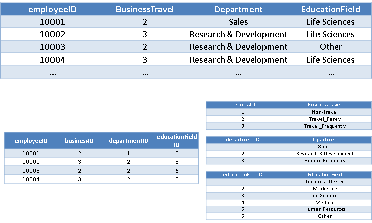
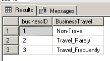

# Database  Normalization Planning Presentation 

## Intro

In this project, I downloaded a source dataset and modified it for practice normalization on a complex dataset with lots of duplicate values.

[Source dataset: https](https://www.kaggle.com/pavansubhasht/ibm-hr-analytics-attrition-dataset/download)[://](https://www.kaggle.com/pavansubhasht/ibm-hr-analytics-attrition-dataset/download)[www.kaggle.com/pavansubhasht/ibm-hr-analytics-attrition-dataset/download](https://www.kaggle.com/pavansubhasht/ibm-hr-analytics-attrition-dataset/download)

Comments:

1. the source dataset is a massive dataset

2. I've simplified it for the purpose of this exercise


## Goal of this Project

1. Study the employee’s correlation between travel activities, department and education field.

2. Using our generated employeeID as identity (original ID was removed due to privacy protection limitation)

Steps and Processes:

1. Convert to 1st Normal form

2. Normalize BusinessTravel

3. Normalize Department

4. Normalize Education Field Columns


### Starting Point  

|      | **BusinessTravel** | **Department**         | **EducationField** |
| ---- | ------------------ | ---------------------- | ------------------ |
|      | Travel_Rarely      | Sales                  | Life Sciences      |
|      | Travel_Frequently  | Research & Development | Life Sciences      |
|      | Travel_Rarely      | Research & Development | Other              |
|      | Travel_Frequently  | Research & Development | Life Sciences      |
|      | …                  | …                      | …                  |

### 1st Normal Form  

| **employeeID** | **BusinessTravel** | **Department**         | **EducationField** |
| -------------- | ------------------ | ---------------------- | ------------------ |
| 10001          | Travel_Rarely      | Sales                  | Life Sciences      |
| 10002          | Travel_Frequently  | Research & Development | Life Sciences      |
| 10003          | Travel_Rarely      | Research & Development | Other              |
| 10004          | Travel_Frequently  | Research & Development | Life Sciences      |
| …              | …                  | …                      | …                  |

### Normalizing BusinessTravel  

| **employeeID** | **BusinessTravel** | **Department**         | **EducationField** |
| -------------- | ------------------ | ---------------------- | ------------------ |
| 10001          | 2                  | Sales                  | Life Sciences      |
| 10002          | 3                  | Research & Development | Life Sciences      |
| 10003          | 2                  | Research & Development | Other              |
| 10004          | 3                  | Research & Development | Life Sciences      |
| …              | …                  | …                      | …                  |

| **businessID** | **BusinessTravel** |
| -------------- | ------------------ |
| 1              | Non-Travel         |
| 2              | Travel_Rarely      |
| 3              | Travel_Frequently  |


### Normalizing Department  

| **employeeID** | **BusinessTravel** | **Department** | **EducationField** |
| -------------- | ------------------ | -------------- | ------------------ |
| 10001          | 2                  | 1              | Life Sciences      |
| 10002          | 3                  | 2              | Life Sciences      |
| 10003          | 2                  | 2              | Other              |
| 10004          | 3                  | 2              | Life Sciences      |
| …              | …                  | …              | …                  |

| **businessID** | **BusinessTravel** |
| -------------- | ------------------ |
| 1              | Non-Travel         |
| 2              | Travel_Rarely      |
| 3              | Travel_Frequently  |

| **departmentID** | **Department**         |
| ---------------- | ---------------------- |
| 1                | Sales                  |
| 2                | Research & Development |
| 3                | Human Resources        |

### Normalizing EducationField  

| **employeeID** | **BusinessTravel** | **Department** | **EducationField** |
| -------------- | ------------------ | -------------- | ------------------ |
| 10001          | 2                  | 1              | 3                  |
| 10002          | 3                  | 2              | 3                  |
| 10003          | 2                  | 2              | 6                  |
| 10004          | 3                  | 2              | 3                  |
| …              | …                  | …              | …                  |

| **businessID** | **BusinessTravel** |
| -------------- | ------------------ |
| 1              | Non-Travel         |
| 2              | Travel_Rarely      |
| 3              | Travel_Frequently  |

| **departmentID** | **Department**         |
| ---------------- | ---------------------- |
| 1                | Sales                  |
| 2                | Research & Development |
| 3                | Human Resources        |

| **educationFieldID** | **EducationField** |
| -------------------- | ------------------ |
| 1                    | Technical Degree   |
| 2                    | Marketing          |
| 3                    | Life Sciences      |
| 4                    | Medical            |
| 5                    | Human Resources    |
| 6                    | Other              |


### Create a View

Create a view that’s identical to the starting point but as a view (virtual table)

| **employeeID** | **BusinessTravel** | **Department**         | **EducationField** |
| -------------- | ------------------ | ---------------------- | ------------------ |
| 10001          | 2                  | Sales                  | Life Sciences      |
| 10002          | 3                  | Research & Development | Life Sciences      |
| 10003          | 2                  | Research & Development | Other              |
| 10004          | 3                  | Research & Development | Life Sciences      |
| …              | …                  | …                      | …                  |


### End result

After performing normalization operations on BusinessTravel, Department, and EducationField, we now have three separate tables with no duplicating values in each of their own normalized lookup table.



## Files related to this project

 [Query.sql](https://github.com/stan587/BVC_TSI_Database_Administration_Fundamentals/blob/master/Normalization_Exercise/Query.sql) -- The code I've written to perform the operations documented above.

[idedHRData.csv](https://github.com/stan587/BVC_TSI_Database_Administration_Fundamentals/blob/master/Normalization_Exercise/idedHRData.csv) -- The source dataset used in this project, which I've downloaded from kaggle.com


## Extras

Credits:

[@EnzaWard]: https://github.com/EnzaWard

 A college of mine figured out a smart way to insert normalized lookup table, resulting in indexing column on the most left column and distinct values of a columns from a source data set in another:

  

Sample of code used to achieve this:

```sql
SELECT DISTINCT IDENTITY (INT, 1,1) AS businessID, BusinessTravel 

INTO normalizeBusiness2 

FROM simplifiedTable; 

SELECT * FROM normalizeBusiness2; 
```

